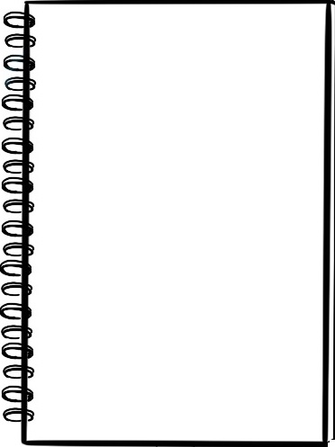

# Assignment 4 | Last updated 11/13/2021
| Second Semester, course MMC5277 |

This example code will create a better practice to what we learned through the past weeks using only CSS and HTML.

## Code

In order for this to work correctly, please make sure you create a `<div>` as follows in HTML:

```html
<div class="items">
    <div class="red" >
        
    </div>

    <div class="notebook">
         
    </div>
</div>
```

The `<div>` have 2 different classes: 
1. `items` is used to show where all the items on the `main` content are.
2. `red` and `notebook` are to identify each of the items.
    + `redpen` to identify image of red color.
    + `nb` to identify image of notebook.

*If you would like to add an image to the `main` content, it __must__ be within the `items` div with its own identifying individual classes.*
## Animations

If you are going to add an animation, your CSS should look like this: 

```css
@keyframes jump {
    20%,
    100% {
      transform: translate(0, 3px);
    }

    0% {
      transform: translate(0, 0px);
    }

    10% {
      transform: translate(0, 6px);
    }
  }
  ```

## Resources

- [How to do a CSS Animation](https://ufl.zoom.us/recording/play/pFAh_A8oQ2fLWqWoLa0SNUoqDk10-_X-vQMVbrUHvjw1BsLK16Wi4KQYberm4SnB?autoplay=true&startTime=1540684427000 "Animation through CSS") 
- [Animations on CSS variation](https://freefrontend.com/css-text-animations/ "61 different CSS Animations")


I, Sharolayn Jarque, have read the point deduction list and understand that I will lose points for missing items.


